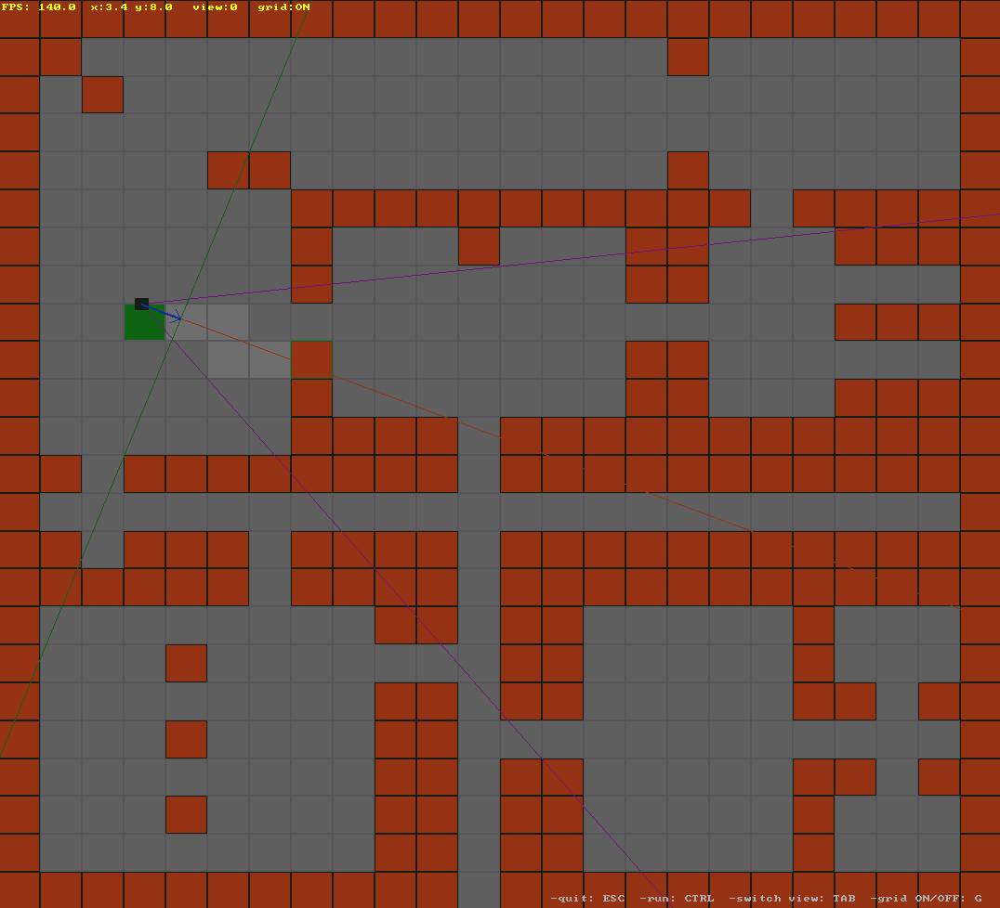
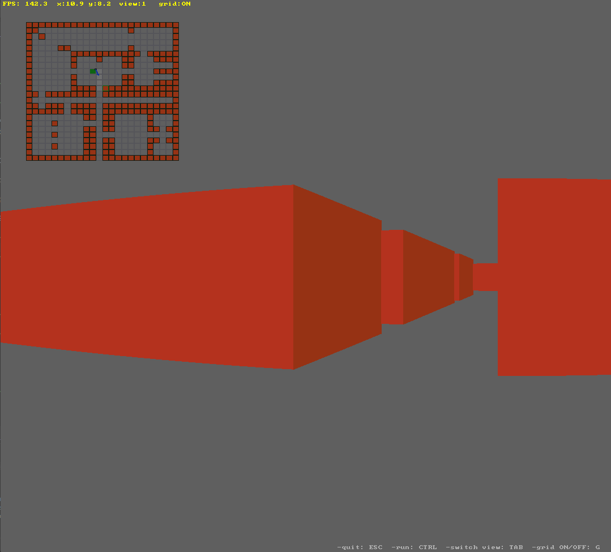

# custom untextured raycasting  

My custom implementation of raycasting following [Lode's raycasting tutorial](https://lodev.org/cgtutor/raycasting.html) and using the *SDL3 library.*

## requirements

  - CMake 3+
  - SDL3

## 1. build with cmake

- ### CMake

    ```bash
    mkdir build
    cd build 
    cmake ..
    cmake --build .
    ```

## 2. controls

- **ESC**: quit  
- **TAB**: switch view  
- **G**: toggle *ON/OFF* grid on 2D map  
- **LCTRL**: move faster

## 3. screenshots

- ### 2D map view
>
> 

- ### 3D view with minimap
>
> 

## 4. notes

  This program was made as a side project while learning C
  as my first uni programming language
